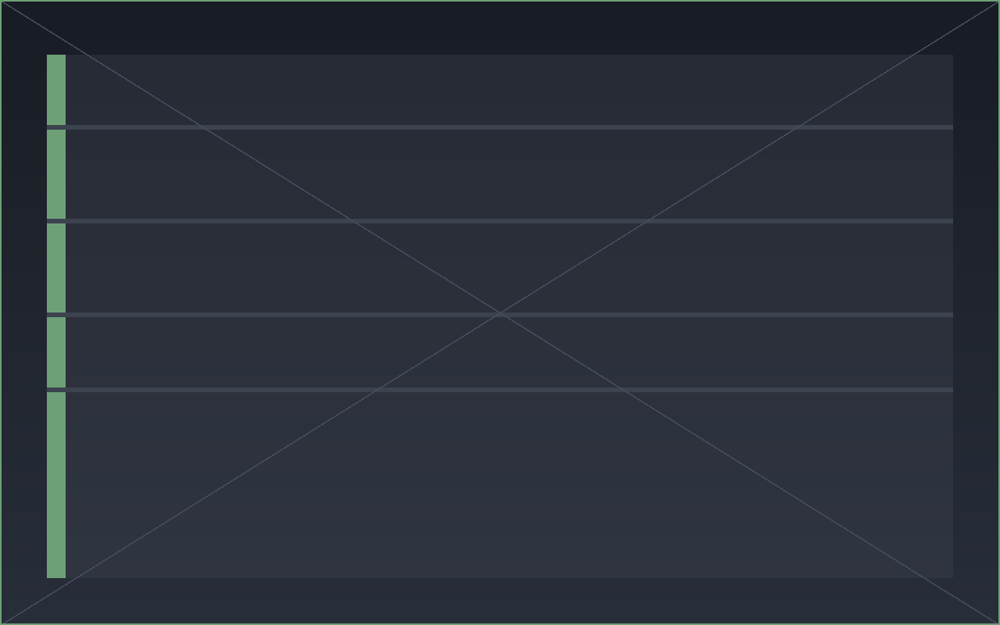

# Puzle Read — Obsidian 插件

把你在 [Puzle Read](https://puzle.com.cn) 中的阅读资产同步进 Obsidian 知识库：

- **文章 / 高亮 / 评论同步** — 每篇文章、每条高亮一个 Markdown 文件，附带 `Articles.base`、`Highlights.base` 数据库视图，可按主题、分类、文章、时间筛选浏览；文章正文中用 `==高亮==` 标记还原你的划线，角标 💬 悬停即可预览想法。
- **AI 对话** — 右边栏聊天面板直连 Puzle AI，流式回复、可停止；历史会话可继续，新会话下次同步自动落地为 `Chats/` 下的 Markdown。
- **AI 续写** — 在任意笔记中执行「AI 续写」，AI 基于光标前的上文流式续写，随时可中断。




## 安装

要求 Obsidian ≥ 1.10.0（Bases 视图依赖）。

### 方式一：BRAT（推荐，可自动更新）

1. 在社区插件市场安装并启用 [BRAT](https://github.com/TfTHacker/obsidian42-brat)。
2. 命令面板执行 `BRAT: Add a beta plugin for testing`，填入本仓库地址（`PriorShape/puzle-read-obsidian`）。
3. 在 设置 → 第三方插件 中启用 **Puzle Read**。

### 方式二：手动安装

1. 从 [Releases](../../releases) 下载 `main.js`、`manifest.json`、`styles.css`。
2. 放入 vault 的 `.obsidian/plugins/puzle-read/` 目录。
3. 重启 Obsidian，在 设置 → 第三方插件 中启用 **Puzle Read**。

### 可选：模板 vault

如果你想在一个全新的 vault 里体验，可以下载 `puzle-read-template-vault.zip`（Releases 附件，或本地执行 `npm run build:template` 生成于 `dist/`），解压后即得到预置好 `PuzleRead/` 目录结构与 Base 视图的模板。插件首次同步时也会自动生成同样的结构，模板并非必需。

## 配置

打开 设置 → **Puzle Read**：

1. **Base URL** — 后端服务地址，默认为产品环境，一般无需修改。
2. **Token** — 获取方式：
   1. 用浏览器登录 Puzle Read Web 端；
   2. 打开开发者工具（F12）→ Application / 存储 → Local Storage；
   3. 复制 `puzle_auth_token` 的值，粘贴到设置页的 Token 输入框。
3. 点击 **测试连接** — 显示「连接成功：<用户名>」即配置完成。
4. 按提示执行命令 **「Puzle Read: 全量同步」**。首次同步会自动初始化 `PuzleRead/` 工作区（文件夹 + Base 视图 + 使用说明），然后拉取全部文章、高亮与对话。

其他设置项：同步根目录（默认 `PuzleRead`）、自动同步间隔（默认关闭）、是否在正文注入高亮锚点、对话是否保留思考过程、managed 区被本地编辑后的写入策略、续写上下文字符上限。

> Token 过期后接口会返回 401，插件会弹出「Token 已失效」提示，重新粘贴新 Token 即可。

## 使用

### 同步

- 命令：`Puzle Read: 全量同步` / `Puzle Read: 增量同步` / `Puzle Read: 初始化工作区`。
- 增量同步只拉取有变化的条目；也可在设置里开启定时自动同步。
- 每个同步文件中 `%% puzle:begin %%` 与 `%% puzle:end %%` 之间的内容由插件维护，请勿编辑；区外内容完全属于你，同步永不触碰。文件可随意重命名 / 移动，插件按 frontmatter 中的 id 定位。
- 打开 `PuzleRead/Articles.base` / `PuzleRead/Highlights.base` 即可用数据库视图浏览全部文章与高亮。

### AI 对话

- 点击左侧 ribbon 的 💬 图标，或执行命令 `Puzle Read: 打开聊天`。
- 顶部下拉可切换 / 新建会话；Enter 发送，Shift+Enter 换行；流式回复过程中可点击停止。
- 在 Obsidian 发起的对话保存在产品侧，下次同步后出现在 `PuzleRead/Chats/`。

### AI 续写

- 在任意笔记中把光标放到想续写的位置，执行命令 `Puzle Read: AI 续写`（也在编辑器右键菜单中）。
- 续写内容流式插入光标处，不带任何标记；再次执行命令或点击状态栏「Puzle 续写中…（点击停止）」即可中断。

---

## 开发

要求 Node.js ≥ 18。

```bash
npm install
npm run dev             # esbuild watch 模式，产出根目录 main.js
npm run build           # tsc 类型检查 + esbuild production 构建
npm test                # vitest run（core/sync 纯逻辑单测）
npm run build:template  # 生成模板 vault 并打包为 dist/puzle-read-template-vault.zip
```

### 在测试 vault 中调试

1. 准备一个测试用 vault（不要用日常 vault）。
2. 把构建产物链接（或拷贝）到 vault 的插件目录：

   ```bash
   # 方式一：软链整个仓库（推荐，dev watch 下改动即时生效）
   ln -s "$(pwd)" "<你的测试vault>/.obsidian/plugins/puzle-read"

   # 方式二：只拷贝三个产物文件
   mkdir -p "<你的测试vault>/.obsidian/plugins/puzle-read"
   cp main.js manifest.json styles.css "<你的测试vault>/.obsidian/plugins/puzle-read/"
   ```

3. 在 Obsidian 设置 → 第三方插件 中启用 "Puzle Read"（首次需关闭安全模式）。
4. 修改代码后保持 `npm run dev` 运行，在 Obsidian 里 **Cmd+R** 重载即可看到最新构建。

### 目录结构

```
src/
├─ core/            # 纯 TS 领域层，禁止 import 'obsidian'（网络等经 ports 注入）
│  ├─ api/          #   PuzleClient REST 封装
│  └─ ws/           #   WebSocket 连接管理 / 流式聚合
├─ adapters/        # Obsidian 平台适配（requestUrl / WebSocket / Notice）
├─ vault/           # VaultGateway / 脚手架 / .base 生成
├─ sync/            # 同步引擎与各 Syncer
│  └─ render/       #   Markdown 模板渲染
├─ chat/            # ChatView(ItemView) + React 组件
│  └─ components/
├─ writer/          # AI 续写命令
└─ main.ts          # 装配点：注册命令/视图/设置
```

需求见 `docs/PRD.md`，模块边界与关键流程见 `docs/TECH_SPEC.md`。
